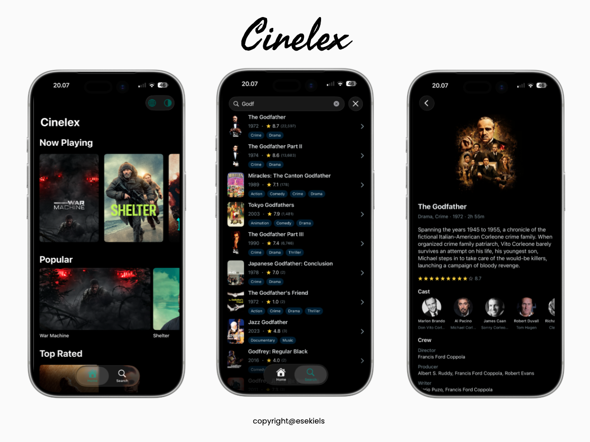

<h1 align="center">Cinelex</h1>

<p align="center">A movie discovery iOS app built with SwiftUI, featuring modular architecture, offline-first caching, runtime theme & language switching, and comprehensive test coverage.</p>

<p align="center">


</p>

## Features

- Browse movies by Now Playing, Popular, Top Rated, and Upcoming
- Search movies with paginated results
- Movie details with cast, crew, and trailer links
- Light / Dark / System theme switching
- English / Indonesian language switching (UI + API)
- Offline-first with SwiftData caching

## Setup

1. Get your API token from [TMDB](https://www.themoviedb.org/settings/api) (free account)
2. Open `Cinelex/Config.xcconfig`
3. Replace the placeholder:

```
TOKEN = YOUR_TMDB_TOKEN_HERE
```

## Tech Stack

- **iOS 17+** / **Swift 6.2**
- **SwiftUI** — `@Observable`, `NavigationStack`, `Environment`
- **Swift Concurrency** — async/await, Actors
- **SwiftData** — local persistence
- **URLSession** — REST API networking
- **[Kingfisher](https://github.com/onevcat/Kingfisher)** — image loading & caching
- **[SwiftLint](https://github.com/realm/SwiftLint)** — code style enforcement

## Architecture

MVVM + Repository pattern with unidirectional data flow:

```
View → ViewModel → Repository → Service / DAO
                                  ↓        ↓
                               Network  SwiftData
```

- **Views** observe `@Observable` ViewModels
- **Repositories** coordinate remote (API) and local (SwiftData) data sources
- **Offline-first** — cached data displays immediately, fresh data loads in background

## Modules

The project uses [Swift Package Manager](https://www.swift.org/documentation/package-manager/) for modularization:

```
Cinelex/                  # App entry point, DI factory, tab view
├── Core/
│   ├── Common/           # Shared constants, extensions, localization
│   ├── Design/           # UI components (shimmer, placeholders)
│   ├── Navigation/       # App coordinator
│   ├── Model/            # DTOs and data models
│   ├── Network/          # API client and services
│   ├── Database/         # SwiftData entities and DAOs
│   ├── Data/             # Repositories (local + remote)
│   └── Datastore/        # User preferences (theme, locale)
└── Feature/
    ├── Splash/           # Animated splash screen
    ├── Home/             # Movie carousels
    ├── Search/           # Search with pagination
    └── Details/          # Movie details, cast, trailers
```

## Testing

| Module | Type | Coverage |
|--------|------|----------|
| Network | Unit | Mocked API responses |
| Database | Unit | In-memory SwiftData |
| Data | Unit | Mocked local/remote sources |
| Feature | Unit | ViewModels with mock repositories |

## API

[The Movie Database (TMDB)](https://www.themoviedb.org/) — free RESTful API for movie data, images, ratings, and more.

## License

```
Copyright 2026 Esekiel Surbakti

Licensed under the Apache License, Version 2.0 (the "License");
you may not use this file except in compliance with the License.
You may obtain a copy of the License at

    http://www.apache.org/licenses/LICENSE-2.0

Unless required by applicable law or agreed to in writing, software
distributed under the License is distributed on an "AS IS" BASIS,
WITHOUT WARRANTIES OR CONDITIONS OF ANY KIND, either express or implied.
See the License for the specific language governing permissions and
limitations under the License.
```
